# Arch installation

This file contains full instructions for how to install Arch linux via the `archinstall` command on the ZenBook Duo.

## Prerequisites

### BIOS Version 308

The newest BIOS Version for the **_Asus ZenBook UX481FL_** is version **_308_**[^1]. This guide is based on that version and with all the issues I had before it is probably a smart move to update to the newset version.

> [!NOTE]
> BIOS Image can be found here <br>
> https://www.asus.com/laptops/for-home/zenbook/zenbook-duo-ux481/helpdesk_bios/?model2Name=Zenbook-Duo-UX481 

Detailed instructions on updating the BIOS can be found in [update_bios.md](update_bios.md)

### BIOS Settings

- under the `Advanced` tab go down to `SATA Configuration` an set `SATA Mode Selection` to `[AHCI]`
- under the `Boot` tab go to `Fast Boot` and disable it
- under the `Security` tab go down to `Secure Boot` and set it to `Disabled`
- press `F10` to save and exit BIOS

You have now set the SATA mode to AHCI, disabled Fast Boot and Secure Boot.

### SSD Firmware

I am using a **_Samsung 970 EVO Plus 1TB_** make sure it als has the newest version installed. The eseaiest way to check is by using Samsung Magican on a Windows machine.

## Booting

When powering on your ZenBook Duo you should se a screen similar to this one. Ther will be a 15 second timer at the bottom just press the down and up arrow keys to abort the timer. 

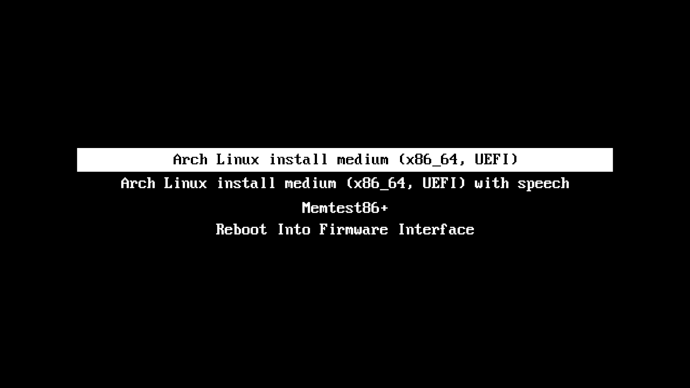

With the first option selected press `e`. We will input some additional starting parameters.

> [!NOTE]
> **Why are we adding additional parameters?** <br>
> As I noticed this exact laptop model has difficulties having the SSD in a D0 state where it can be used to write the installation on. If you don't use these parameters the SSD will likely show up in the beginning (`lsblk`) but afterwards turn into a D3cold state to save power. I suppose this is happening because the installer and Laptop dont communicate correctly. By inputting these parameters the SSD will remain in the D0 state no matter what.

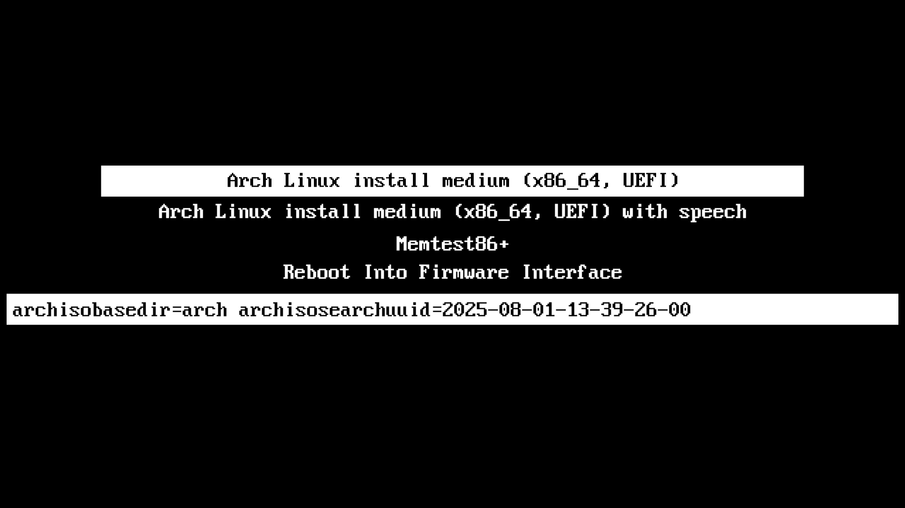

Now please add these parameters to the line right after the parameters you already see. 

`nvme_core.default_ps_max_latency_us=0 pcie_aspm=off pcie_port_pm=off nvme.noacpi=1`

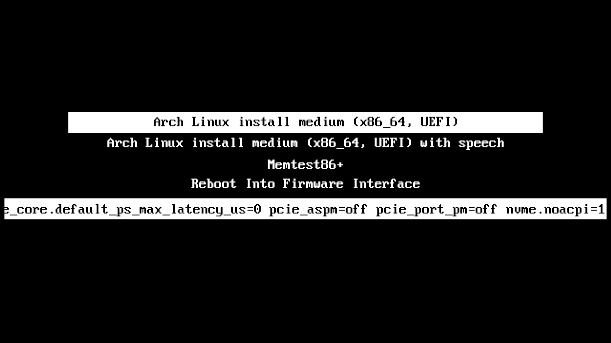

> [!NOTE]
> **What do the parameters do?** <br>
> - **_default_ps_max_latency_us=0_** → disables APST (auto power states). <br>
> - **_pcie_aspm=off_** → disables PCIe Active State PM. <br>
> - **_pcie_port_pm=off_** → disables port-level runtime PM (stops link from going to D3cold). <br>
> - **_nvme.noacpi=1_** → ignores buggy ACPI tables that might try to override.

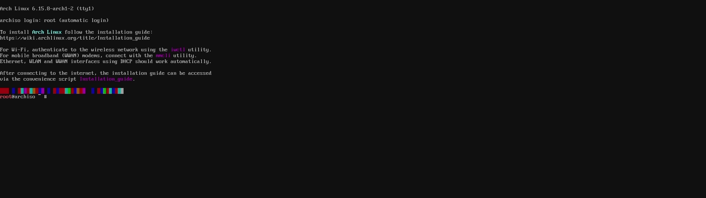

Before starting the installation we need to perform one last step to stop the SSD from going into a power save mode. 
Execute the following command:

``` shell
cat /sys/class/nvme/nvme0/device/power/control
```

If it returnes `auto` (which is likely) execute:

``` shell
echo on | sudo tee /sys/class/nvme/nvme0/device/power/control
```

> [!NOTE]
> You can check if your SSD is working by running `lsblk`. Under the nvme section you should se a `nvme0n1`. Make srue the size is correct so however large your SSD is if the SSD is in a poersaving mode and the installation can't access it there will be a size of 0B.
>``` shell
>lsblk
>```

## Installation

### Connect to the Internet

First make sure you have a stable internet connection or a internet conenction at all. Due to the ZenBook duo not having an eternet port we need to establish a connection wirelessly.

Run `ip addr show` to show existing network adapters. There will a **_wlan0_** which we are going to use to connect via wifi.

To show available networks run `iwctl` which will open up a seperate console. And the type in `station wlan0 get-networks`
``` shell
iwctl
```
``` shell
station wlan0 get-networks
```

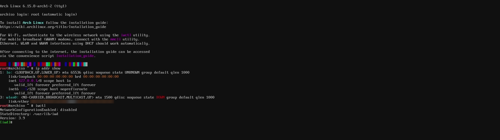

Connect to your network with:

``` shell
iwctl --passphrase "{{password}}" station wlan0 connect {{SSID}}
```

> [!NOTE]
> Replace {{password}} and {{SSID}} with your networks password and name.

<br>

> [!NOTE]
> You can run `ip addr show` to check weather there was a IP address assigned. Your IP will show up in the wlan0 section.
>``` shell
>ip addr show
>```

> [!TIP]
> Since a internet connection is now established you can also continue via another machine over ssh. <br>
> See [`ssh_install.md`](ssh_install.md) for further information an instructions.

### Installing Arch

Run `archinstall` to start a "guided" installation of Arch Linux.

``` shell
archinstall
```

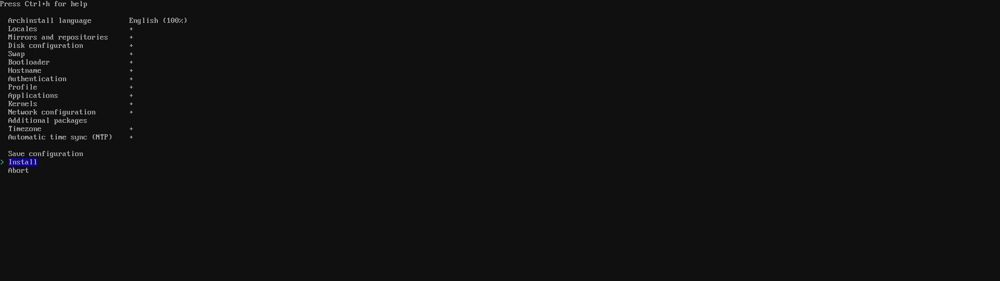

> [!NOTE]
> I will provide you with some general settings here. If you want more detailed instructions with screenshorts on `archinstall` look here: [`archinstall.md`](archinstall.md)

- `Archinstall language` set to your needs
- `Locales` set to your keyboard layout and country specific settings
- `Mirrors and repositories` set `Select region` to your country
- `Disk configuration` best-effort default partition layout works. If you want to make incremental snapshots of your system. I recommend `btrfs` for the filesystem type. If choosen select `yes (default)` for the default structure and `Use compression` to enable CoW(Copy on Write)
- `Bootloader` set to `GRUB`
- `Hostname` set to your liking
- `Authentication` set up a password for root and create a new user that is a superuser
- `Applications` leave `Bluetooth` as is and inside `Audio` change to pipewire
- `Kernels` linux (default)
- `Network configuration` select `Use NetworkManager`
- `Timezone` set to your timezone

Go down to install and start installing Arch.

<!-- TODO short form of mandatory configuration and new file with long explanation -->


> [!CAUTION]
> Do **`not`** reboot imediately. We need to make some power settings of the SSD permanet.

### Post install

#### Permanent SSD power settings

When asked chroot into installation.


You will now see a fesh console where we can setup some stuff.

For configuring we need to use any editor of choice we will use nano which needs to be installed with:

``` shell
pacman -Sy nano
```

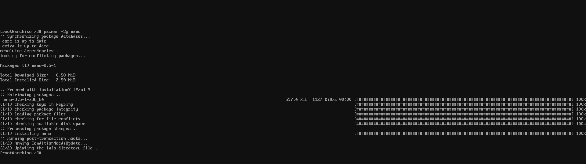

Now open the grub config file with: `sudo nano /etc/default/grub`.

``` shell
sudo nano /etc/default/grub
```

The line `GRUB_CMDLINE_LINUX_DEFAULT="quiet"` needs to be replaced by `GRUB_CMDLINE_LINUX_DEFAULT="quiet nvme_core.default_ps_max_latency_us=0 pcie_aspm=off pcie_port_pm=off nvme.noacpi=1"`

> [!NOTE]
> You might remember. These were the parameters we used at the beginning.

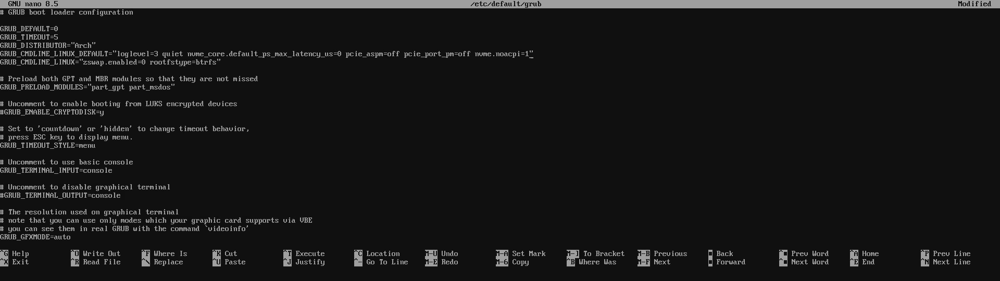

> [!NOTE]
> Exit nano with `CTRL` + `X` and save the changes.

Run `sudo grub-mkconfig -o /boot/grub/grub.cfg` to make the chnages permanent.

``` shell
sudo grub-mkconfig -o /boot/grub/grub.cfg
```

<br>
<br>

To actually force the state we need to do one last thing. Start creating a new service with `sudo nano /etc/systemd/system/nvme-d0.service`

``` shell
sudo nano /etc/systemd/system/nvme-d0.service
```

``` nano
[Unit]
Description=Force NVMe to D0 (disable runtime PM)
After=multi-user.target

[Service]
Type=oneshot
ExecStart=/bin/sh -c 'echo on > /sys/class/nvme/nvme0/device/power/control'

[Install]
WantedBy=multi-user.target
```

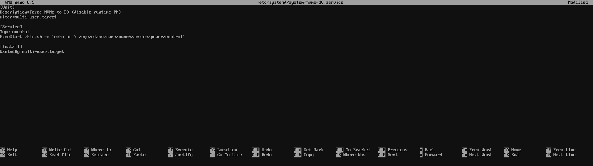

> [!NOTE]
> Exit nano with `CTRL` + `X` and save the changes.

Now enable the service so it starts on every boot `sudo systemctl enable nvme-d0.service`.
``` shell
sudo systemctl enable nvme-d0.service
```

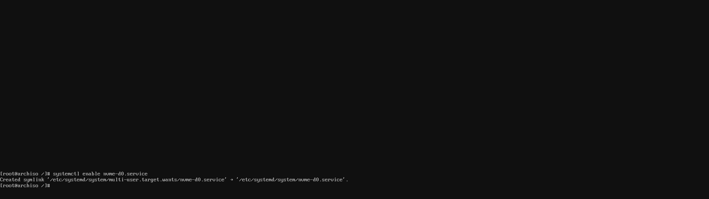

> [!WARNING]
> Plase do **`not`** reboot now. We will now setup a desktop environment and display manager so you can enjoy it the first time you boot into your system.

#### Desktop environment and display manager

There are many desktop environemtns and display managers out there we will be using [KDE-Plasma](https://kde.org/de/plasma-desktop/)[^2] and [SDDM](https://wiki.archlinux.org/title/SDDM)[^3].

First fully update the system `sudo pacman -Syu`.

``` shell
sudo pacman -Syu
```

Install KDE Plasma and its standard applications with `sudo pacman -S plasma kde-applications`.

``` shell
sudo pacman -S plasma kde-applications
```

> [!NOTE]
> When asked so select a source for some packages the default is fine.

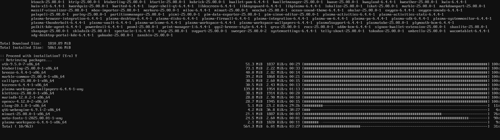

> [!NOTE]
> The installation process of KDE Plasma can take some time.

Install SDDM with `sudo pacman -S sddm`.

``` shell
sudo pacman -S sddm
```

After installing SDDM enable it `sudo systemctl enable sddm`

``` shell
sudo systemctl enable sddm
```

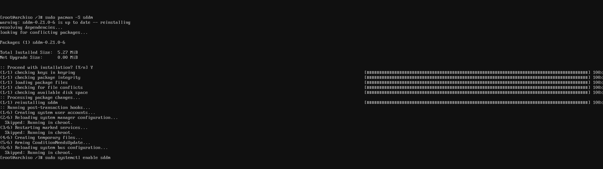

## Reboot

> [!WARNING]
> Now is a good time to remove the installation media. If not removed the system could try rebooting into the installer.

You might need to type `exit` to get out of the current console. Reboot the system with `sudo reboot`.

``` shell
sudo reboot
```

> [!NOTE]
> SDDMs Interface could look a bit out of date. The eseaiest way to change it is using the GUI. After logging in you can search for `SDDM` inside the system settings.

> [!TIP]
> You are free to customize your Arch Linux form now on. Here are some sttings that are **_ZenBook Duo_** specific that I [would recommend](settings_suggestions.md) (see [`settings_suggestions.md`](settings_suggestions.md)).

[^1]: https://www.asus.com/laptops/for-home/zenbook/zenbook-duo-ux481/helpdesk_bios/?model2Name=Zenbook-Duo-UX481
[^2]: https://kde.org/de/plasma-desktop/
[^3]: https://wiki.archlinux.org/title/SDDM