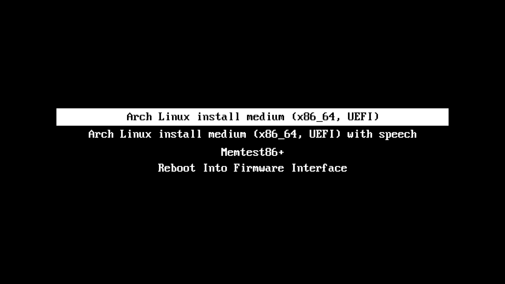
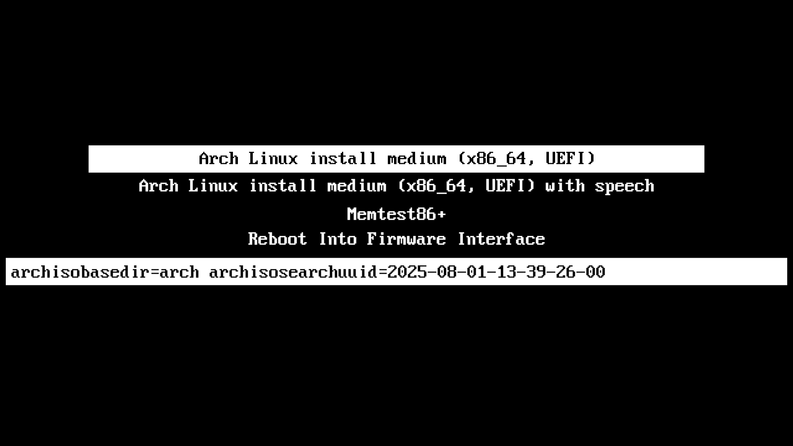
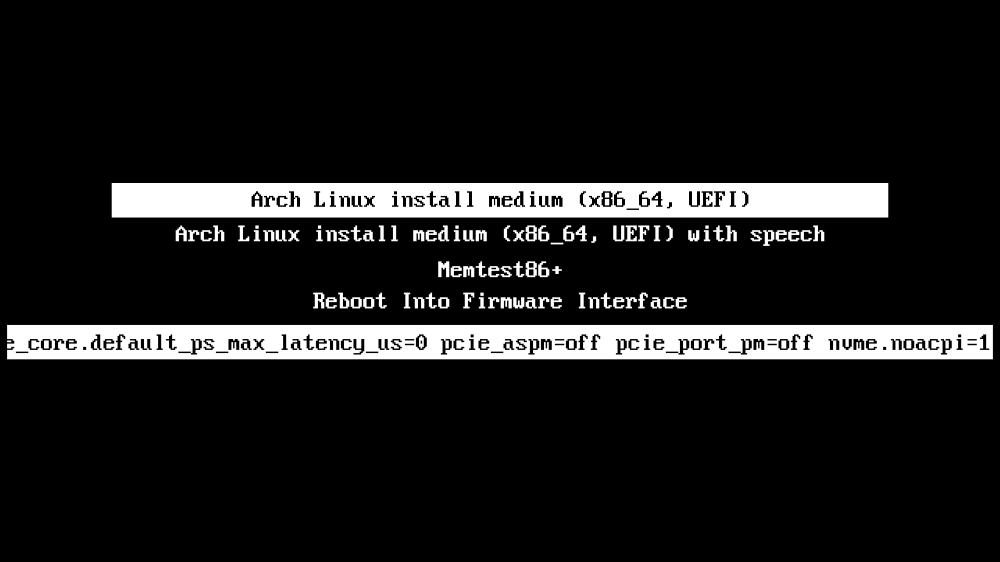

# Arch installation

This file contains full instructions for how to install Arch linux via the `archinstall` command on the ZenBook Duo.

## Prerequisites

### BIOS Version 308

The newest BIOS Version for the **_Asus ZenBook UX481FL_** is version **_308_**[^1]. This guide is based on that version and with all the issues I had before it is probably a smart move to update to the newset version.

> [!NOTE]
> BIOS Image can be found here  
> https://www.asus.com/laptops/for-home/zenbook/zenbook-duo-ux481/helpdesk_bios/?model2Name=Zenbook-Duo-UX481 

Detailed instructions on updating the BIOS can be found in [update_bios.md](update_bios.md)

### BIOS Settings

- under the `Advanced` tab go down to `SATA Configuration` an set `SATA Mode Selection` to `[AHCI]`
- under the `Boot` tab go to `Fast Boot` and disable it
- under the `Security` tab go down to `Secure Boot` and set it to `Disabled`
- press `F10` to save and exit BIOS

You have now set the SATA mode to AHCI, disabled Fast Boot and Secure Boot.

### SSD Firmware

I am using a **_Samsung 970 EVO Plus 1TB_** make sure it als has the newest version installed. The eseaiest way to check is by using Samsung Magican on a Windows machine.

## Booting

When powering on your ZenBook Duo you should se a screen similar to this one. Ther will be a 15 second timer at the bottom just press the down and up arrow keys to abort the timer. 

With the first option selected press `e`. We will input some additional starting parameters.

> [!NOTE]
> **Why are we adding additional parameters?**  
> As I noticed this exact laptop model has difficulties having the SSD in a D0 state where it can be used to write the installation on. If you don't use these parameters the SSD will likely show up in the beginning (`lsblk`) but afterwards turn into a D3cold state to save power. I suppose this is happening because the installer and Laptop dont communicate correctly. By inputting these parameters the SSD will remain in the D0 state no matter what.

Now please add these parameters to the line right after the parameters you already see. 

`nvme_core.default_ps_max_latency_us=0 pcie_aspm=off pcie_port_pm=off nvme.noacpi=1`

> [!NOTE]
> **What do the parameters do?**  
> - **_default_ps_max_latency_us=0_** → disables APST (auto power states).  
> - **_pcie_aspm=off_** → disables PCIe Active State PM.  
> - **_pcie_port_pm=off_** → disables port-level runtime PM (stops link from going to D3cold).  
> - **_nvme.noacpi=1_** → ignores buggy ACPI tables that might try to override.

[^1]: https://www.asus.com/laptops/for-home/zenbook/zenbook-duo-ux481/helpdesk_bios/?model2Name=Zenbook-Duo-UX481