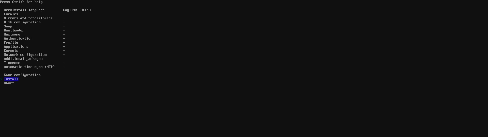

# Archinstall

Run `archinstall` to start a "guided" installation of Arch Linux.

``` shell
archinstall
```



## Archinstall language

- `Archinstall language` set to your needs


## Locales

- `Locales` set to your keyboard layout and country specific settings


## Mirrors and repositories

- `Mirrors and repositories` set `Select region` to your country


## Disk configuration

- `Disk configuration` best-effort default partition layout works. If you want to make incremental snapshots of your system. I recommend `btrfs` for the filesystem type. If choosen select `yes (default)` for the default structure and `Use compression` to enable CoW(Copy on Write)

> [!NOTE]
> Using `btrfs` allows you to make incremental snapshots of your system if setup corretly. This is something that can come in handy because of Arches rowling releases. <br>
> You can also choose the normal `ext4` filesystem.


## Bootloader

- `Bootloader` set to `GRUB`


## Hostname

- `Hostname` set to your liking

## Authentication

- `Authentication` set up a password for root and create a new user that is a superuser

### Root


<br>

### User


## Application

- `Applications` leave `Bluetooth` as is and inside `Audio` change to pipewire


## Kernels

- `Kernels` linux (default)


## Network configuration

- `Network configuration` select `Use NetworkManager`

> [!NOTE]
> By choosing NetworkManager you can later configure network settings with a GUI inside your desktop environment.

## Timezone

- `Timezone` set to your timezone

You can now go back to the [main guide for installing Arch](./README.md#installing-arch).